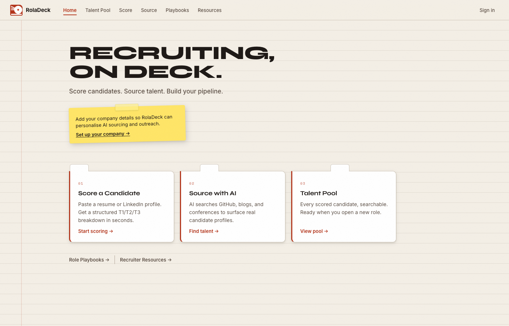
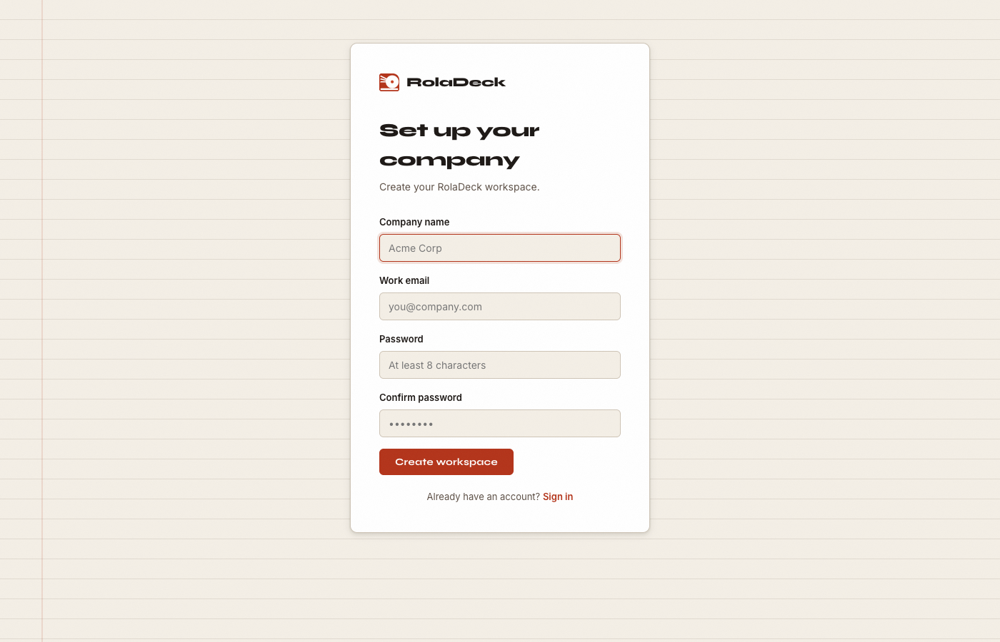
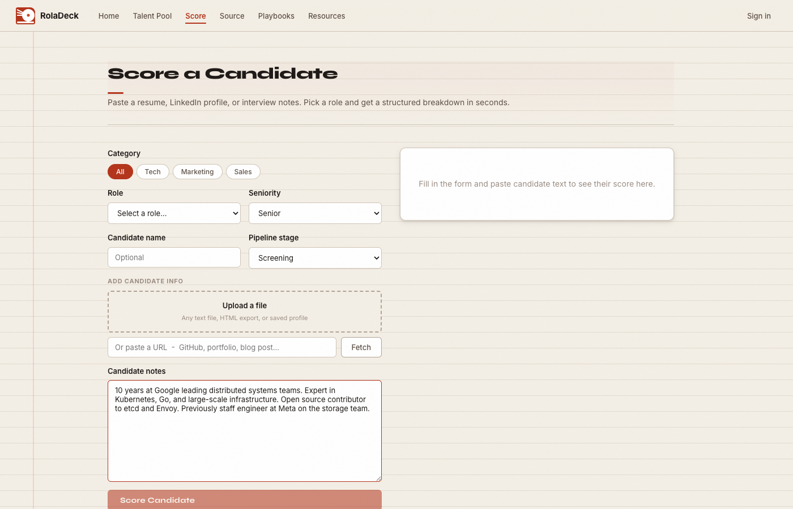
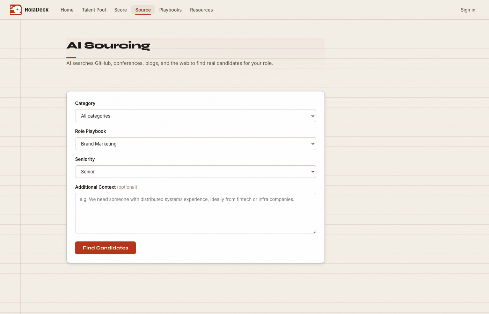
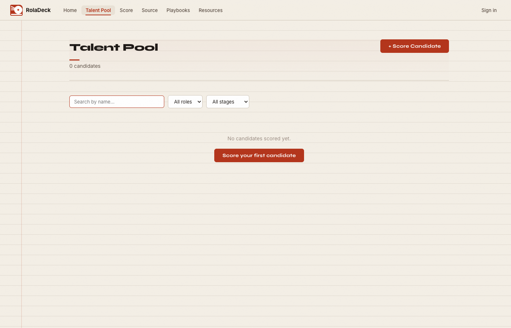
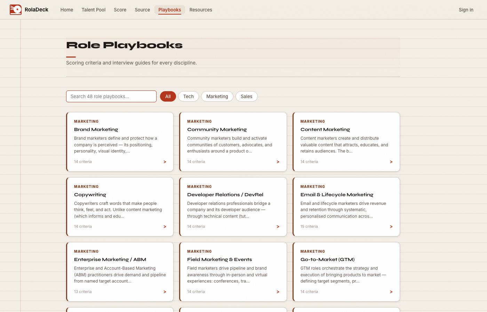
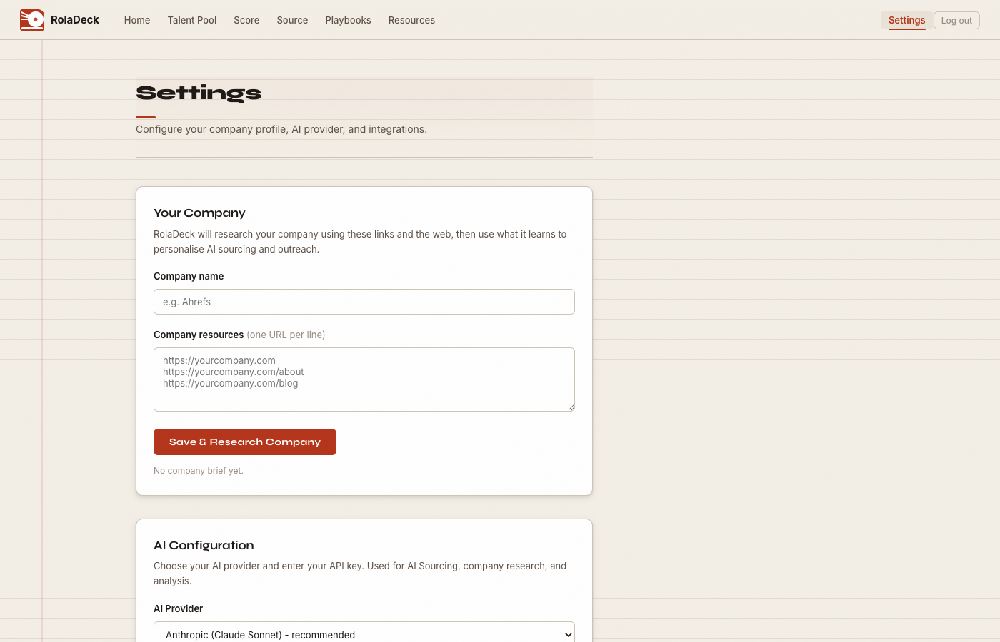

# RolaDeck

Recruiting intelligence that gets sharper over time.

RolaDeck connects to your ATS and scores every inbound application against structured role playbooks. As candidates move through your pipeline it learns which signals actually predict success at your company, and recalibrates accordingly.

It's built as a multi-tenant cloud product. Sign up with your work email and you get an isolated workspace. Anyone else at your company who signs up with the same domain joins the same workspace automatically.

---



---

## How it works

### Set up your workspace

Create an account with your work email. From there you can add your company name, website, blog posts, case studies, articles — anything that gives context about what your company does and what good looks like. That context is used to calibrate AI sourcing and outreach so it's specific to you rather than generic.



### Connect Greenhouse

Link your Greenhouse account and RolaDeck starts pulling in applications automatically. Every candidate is classified and scored as they arrive. You can also score candidates manually if you want to assess someone outside of the ATS flow.

### AI classification

When a candidate comes in, RolaDeck reads their profile and works out what they actually are — not what role they happened to apply for. Someone with a machine learning background who applied for a backend role gets classified as an ML engineer. A product marketer who started out in content gets matched against both playbooks and scored on each.

This matters because most candidates don't apply for the exact role they're best suited for. Classification based on career history gives you a more accurate pool, and surfaces talent for future roles you haven't opened yet.

### Structured scoring

Each role playbook has three tiers: T1 (must-haves), T2 (differentiators), T3 (rare upside). Candidates are scored across all three at whatever seniority level you're hiring for. No scoring rubrics to maintain, no spreadsheets. The Score page also has a detect button — paste a profile, click detect, and it suggests the most relevant playbooks with confidence scores before you commit to scoring.



### Scores that get better over time

As candidates move through your pipeline RolaDeck tracks which criteria actually correlated with people getting hired. Scores recalibrate over time so the tool reflects your hiring bar, not a generic one.

### AI sourcing

AI searches GitHub, conference talks, blogs, and the open web for candidates who match your playbook criteria. You get real profiles with rationale, boolean search strings for LinkedIn and GitHub, a target company list, and a draft outreach message. All of it shaped by the company context you added during setup.



### Talent pool

Every scored candidate is saved and organised by playbook. Candidates can appear under multiple playbooks if they matched more than one. Filter by category, search by name, and filter by pipeline stage within each role. When a new role opens you already have a ranked shortlist to start from.



---

## Role Playbooks

57 playbooks across Tech, Marketing, and Sales. Each one has scoring criteria, seniority signals, sourcing strings, interview stages, and red flags.



---

## Integrations

Connect your AI provider and ATS from Settings. Supports Anthropic Claude, OpenAI, and Perplexity for AI features, and Greenhouse for ATS sync.



---

## Stack

- Backend: OCaml + [Dream](https://aantron.github.io/dream/)
- Frontend: [ReasonML](https://reasonml.github.io/) + [Melange](https://melange.re/) compiled to React
- Build: [Dune](https://dune.build/)
- Auth: PBKDF2-SHA256, HttpOnly session cookies, domain-based multi-tenant isolation
- AI: pluggable provider (Anthropic, OpenAI, Perplexity)
- ATS: Greenhouse sync

---

## Self-hosting

### Prerequisites

- OCaml + opam
- Node.js
- Dune

### Install

```bash
opam switch create . --deps-only
npm install
```

### Run

```bash
dune build
dune exec bin/main.exe   # backend on :4000
npm run dev              # frontend on :3000
```

Connect your AI provider and Greenhouse from Settings. Company data is stored per-tenant under `~/.ahrefs-recruit/tenants/{company_id}/`.
